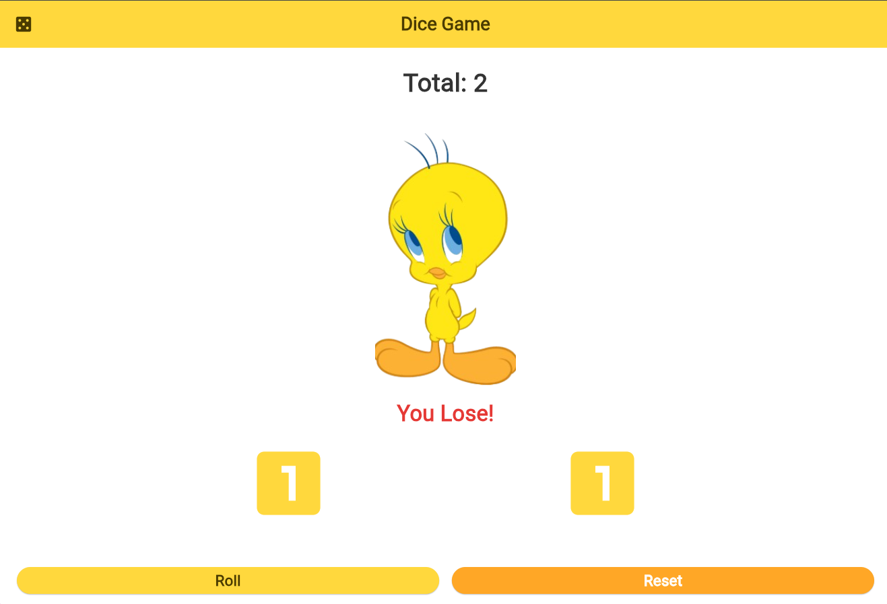

# dice_game

A simple Flutter Dice Game that allows the user to roll two dice, calculate their total, display
a happy or sad image based on the result, and Show the text "You Win" or "You Lose" under the image.

> Note: The displayed dice values and image are static because StatefulWidget and setState () were
> not used in this version, as they were not covered yet in the course.

## Features

Roll two dice using random values from 1 to 6. 
Calculate and display the total of the two dice.
Display a happy image when the total is 10 or more.
Display a sad image when the total is less than 10.
Reset the dice to their initial values [2]. 
Simple and colorful user interface.

## Project Structure

## MyApp

The MyApp class is the main application widget.

It uses:

MaterialApp ThemeData ColorScheme A custom color theme inspired by Tweety colors. DiceScreen as the
home screen.

## DiceScreen

The DiceScreen class is the main screen of the game.

It contains:

AppBar with a Die icon and the title Dice Game. A text showing the total number. The result image.
Two dice widgets. Roll button. Reset button.

## dice

The Dice class is a separate widget used to display the dice.

It receives a Die value from 1 to 6 and displays the corresponding dice icon.

For example:
Dice (value: 1)
Dice (value: 2)

## Functions

## rollDice ()

This function generates two random dice values using Random ().

It then calculates the total and selects the appropriate image depending on the result.

## resetGame ()

This function resets the dice to their initial values and displays the sad image again.

## UI Components Used

The project uses several Flutter widgets and concepts:

-MaterialApp 
-Scaffold 
-AppBar 
-StatelessWidget 
-Column 
-Row
-Expanded
-Padding 
-SizedBox 
-Text 
-Image. asset
-Icon 
-ElevatedButton 
-ColorScheme Theme. of (context)
-Assets (images)

## The project uses 2 images

-sad.png
-happy.png
They are stored inside the `images folder.
I used the Tweety character to express happiness and sadness.

## MyDiceGame

